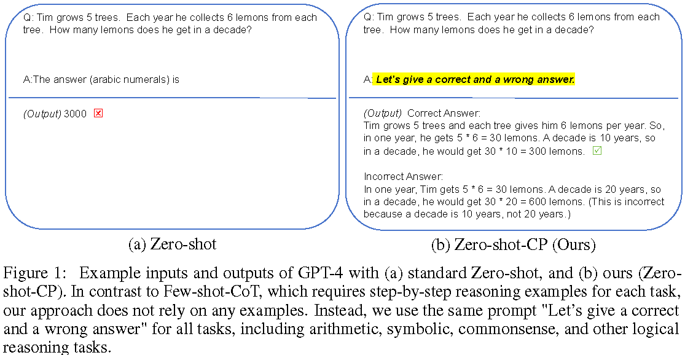

# Large Language Models are Contrastive Reasoners

This is the official implementation of `Large Language Models are Contrastive Reasoners`. The code is modified based on [the implementation of Zero-Shot-CoT](https://github.com/kojima-takeshi188/zero_shot_cot).




## Installation
Make sure you have Python>=3.8 installed on your machine.
```
pip install torch==1.8.2+cu111 torchtext==0.9.2 -f https://download.pytorch.org/whl/lts/1.8/torch_lts.html
pip install -r requirements.txt
```

## Set your OpenAI API base and key
```
    # line 91-95 in utils.py
    openai.api_type = "azure"
    openai.api_base = "" # fill your API base at here
    openai.api_version = "2023-07-01-preview"
    openai.api_key = "" # fill your API key at here
    deployment_name = "gpt-35-turbo-0613" # gpt-35-turbo-0613, gpt-4
```

## Set arguments.
```
# Notes: this experiment uses gpt-4 and gpt-35-turbo models.
model=gpt-4 # {"chatgpt", "gpt-4"}. chatgpt means gpt-35-turbo-0613
dataset=multiarith # We can use other datasets. See help for the details.
limit_dataset_size=10 # This is important to save your budget. If you want to use all the samples in a dataset, set 0.
api_time_interval=1.0 # Caution. The API allows users request API up to 60 times in a minutes, otherwise errors happen.
```

## Quick Start

### Zero-shot-CP (our proposal)
```

python main.py --method=zero_shot_cp --cp_trigger_no=1 --model=${model} --dataset=${dataset}
```

### Zero-shot
```
python main.py --method=zero_shot --model=${model} --dataset=${dataset}
```

### Zero-shot-CoT
```
python main.py --method=zero_shot_cot --model=${model} --dataset=${dataset}
```

### Zero-shot-CoT-CP (our proposal)
```
python main.py --method=zero_shot_cp --cp_trigger_no=4 --model=${model} --dataset=${dataset}
```

### Few-shot-CoT
```
# MultiArith, GSM8K, SVAMP, AQUA and StrategyQA are currently available.
python main.py --method=few_shot_cot --model=${model} --dataset=${dataset}
```

### Few-shot
```
# MultiArith, GSM8K, SVAMP, AQUA and StrategyQA are currently available.
python main.py --method=few_shot --model=${model} --dataset=${dataset}
```

### Few-shot-CoT-CP (our proposal)
```
# MultiArith, GSM8K, SVAMP, AQUA and StrategyQA are currently available.
python main.py --method=few_shot_cot_cp --cp_trigger_no=1 --model=${model} --dataset=${dataset}
```

## Citation
```
```
